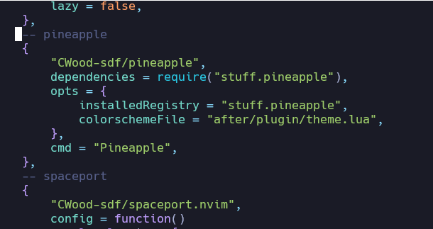

# Pineapple

The ultimate theme manager for Neovim

## Why

The goals of this plugin are:

- Find a theme without using google
- Be able to preview a theme in neovim (including its Tree-sitter support)
- Install a theme and change the colorscheme without touching the config

## Requirements

- Neovim 0.8.0 or greater

## What does it not do

Pineapple is not designed to:

- Find a theme that works with Tree-sitter, though you can find some of those themes by a text filter of "treesitter" or "Treesitter"
- Manage the installation for your theme, that is the package manager's job
- Find a theme for your lualine or anything else that needs to be seperately themed
- Manage any local themes in development you might be using

## Setup

Pineapple has only been tested with lazy.nvim as a package manager, though it probably would work with others.

Here's the quick setup:

1. Create an empty file in your ~/.config/nvim/lua/YOUR_LUA_DIRECTORY directory (or C:\Users\_\AppData\Local\Nvim if you're a Windows user). This file is for storing your installed themes.
2. Create an empty file in the ~/.config/nvim/after/plugin folder (called theme.lua). This file is for setting the colorscheme.
3. Then for setup, put this in your config:

```lua
{
    "CWood-sdf/pineapple",
    dependencies = require("YOUR_LUA_DIRECTORY.pineapple"),
    opts = {
        installedRegistry = "YOUR_LUA_DIRECTORY.pineapple",
        colorschemeFile = "after/plugin/theme.lua"
    },
    cmd = "Pineapple",
}
```

Note that opts.installedRegistry and colorschemeFile are in different file formats. This is so that opts.installedRegistry can be put in a variable at the top of your lazy config file. The directory that both installedRegistry and colorschemeFile are assumed to be in is $HOME\.config\nvim (or %USERPROFILE%\AppData\Local\Nvim if you're a Windows user)

### Using with distros

Some distros have their own way of setting the colorscheme. For example, LunarVim uses the 'lvim.colorscheme' variable to change the colorscheme. To accomodate this, there is a setup option called colorschemeSet, which is a function that determines what to write to colorschemeFile.

Here's an example with it set for LunarVim:

```lua
{
    colorschemeSet = function(scheme)
        return "vim.cmd('colorscheme " .. scheme .. "')\n lvim.colorscheme = '" .. scheme .. "'"
    end
}
```

### My config

Here's an example of my config:



### Setup Options

| option              | description                                                                                                    |
| ------------------- | -------------------------------------------------------------------------------------------------------------- |
| `installedRegistry` | A lua `require`able string that holds the location of the file where the themes to be installed will be stored |
| `colorschemeFile`   | A string that holds the location of the file that will be sourced to set the colorscheme                       |
| `colorschemeSet`    | A function that takes a string and returns a string that will be written to colorschemeFile                    |

## Usage

The plugin can be opened with the command `Pineapple`

This is what the plugin looks like when it is first opened:


All the remaps are shown at the top of the screen.

To preview a plugin, just hit `v` while hovering over it. To install a plugin, hit `i` while hovering over it. To uninstall a plugin, hit `x` while hovering over it in the "Installed" screen. To set the colorscheme, hit `u` while hovering over it in the Installed screen.

## Telescope Integration

Due to lazy.nvim's lazy loading of themes, calling the telescope picker for themes will not return any of the pineapple installed themes. However, pineapple provides an easy way to still use telescope to find a theme.

Just run the code:

```lua
require('telescope').load_extension('pineapple')
require('telescope').extensions.pineapple.colorschemes()

```

## Speed

Pineapple is designed to minimally interrupt your startup time. Nothing is loaded until the plugin is opened with the command `Pineapple` (at least with lazy.nvim).

## Acknowledgements

This whole idea is from the [vimcolorschemes website](https://vimcolorschemes.com/), and I wanted to put that in a neovim extension.

A rewritten version of the [vimcolorschemes worker](https://github.com/vimcolorschemes/worker) was used to generate the theme data.

## Known issues

The preview doesn't account for screen size, so it can look pretty ugly on a small screen.

The VimResize autocmd is not implemented yet, so the preview will not resize with the window.

The filtering capabilities are minimal, and the sorting capabilities are non-existent.

## Api

| Name                      | Description                                     |
| ------------------------- | ----------------------------------------------- |
| `getInstalledThemes()`    | Returns the list of installed themes            |
| `uninstall(theme)`        | Uninstalls the theme from the config file       |
| `install(theme)`          | Installs the theme to the config file           |
| `setColorScheme(theme)`   | Sets the colorscheme to the given parameter     |
| `getInstalledColorData()` | Returns the color data for the installed themes |
| `getAllData()`            | Returns all the data for all the themes         |

## Uninstall

Pineapple is designed to be removed as easily as possible. The steps to remove it are pretty simple:

Add the installation line for whatever your current theme is to your lazy.nvim config file. All your downloaded themes can be seen at ~/.config/nvim/YOUR_LUA_DIRECTORY/YOUR_PINEAPPLE_FILE.lua. After this, you can remove the pineapple install line and run `Lazy sync`.

## Events

Pineapple fires several events that you can attach autocmds to:

| Event Name                 | Description                                                                         |
| -------------------------- | ----------------------------------------------------------------------------------- |
| `PineappleUninstallPre`    | Fired before a theme is uninstalled. The theme's GitHub id is passed as a parameter |
| `PineappleUninstallPost`   | Fired after a theme is uninstalled. The theme's GitHub id is passed as a parameter  |
| `PineappleInstallPre`      | Fired before a theme is installed. The theme's GitHub id is passed as a parameter   |
| `PineappleInstallPost`     | Fired after a theme is installed. The theme's GitHub id is passed as a parameter    |
| `PineappleColorschemePre`  | Fired before a theme is set as the colorscheme. The theme is passed as a parameter  |
| `PineappleColorschemePost` | Fired after a theme is set as the colorscheme. The theme is passed as a parameter   |

### Autocmd Usage

Using the autocmds is very simple, the name of the event is just passed as the pattern argument to the `User` autocmd, like this:

```lua
vim.api.nvim_create_autocmd("User", {
    pattern = "PineappleColorschemePost",
    callback = function(ev)
        print("The colorscheme was set to " .. ev.data[1])
    end,
})
```
